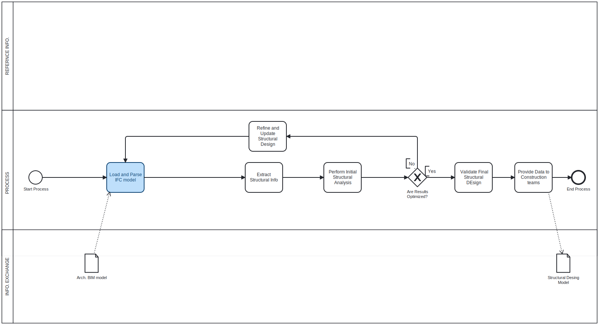
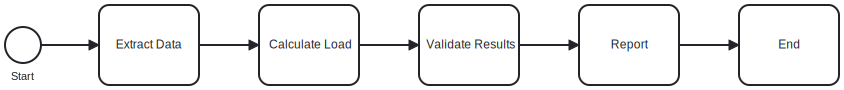

# BIManalyst group 24
# Focus Area: Structural
# Claim: The line load for beams can be calculated through cross-sectional area X material density x gravitational acceleration. 
# Report and page number: CES_BLD_24_06_STR Page 11 Table 7
# Brief description: The script takes the dimensions and densities from the property sets and uses them to calculate the line load for the beams.

# A2a: 
# The sum of our score for our group is 3 out of 12. We are 3 in our group, and one choose 0-strongly disagree, one choose 1-disagree and the last one choose 2-neutral. 
# We are an analyst group. 

# A2b: 
# We are working with bulding #2406 and focusing on structural area. 
# The claim is "to extract data from the project and calculate the line load for the beams"
# The script takes the dimensions and densities from the property sets and uses them to calculate the line load for the beams.
# It is importent to check if the beams can hold the self weight and load from other properties. and compare it with analytical numbers. 

# A2c: 
# We would check the claim by reviewing the beam's IfcBeam object in the BIM model. Specifically, we would ensure the necessary properties, such as area, thickness,
# and material density, are correctly defined in the property sets. We would also validate that the formulas for calculating dead load and line load are accurate 
# and that the beam geometry aligns with the BIM model.

# This claim would typically be checked during the design or planning phase, as the structural integrity (load-bearing capacity) must be verified before construction begins.
# It could also be revisited in the construction phase to ensure the actual materials match the design specifications.

# This claim relies on:

# Beam length (from the geometry or property sets)
# Beam cross-sectional area (from property sets or geometry)
# Material density (from the material specification in property sets)

# Primarily relevant to the design phase, but also applicable in the build phase when verifying actual material properties.

# The required BIM purpose is analyse, as this process involves calculating loads and verifying structural performance.

# The use case 8 gives us the inspiratipn to design our BPMN-diagram. 

# A2d
# Blue color highlights where a new script is needed

# A2e
# A Python tool using ifcOpenShell to extract beam properties (length, cross-sectional area, and material density) from IFC models, calculate dead loads, and validate structural safety.
# Business: Automates load verification, saving time and reducing errors in structural design.
# Societal: Ensures beam safety, reducing structural failures and improving public safety.

# A2f
# Extract: Beam length, cross-sectional area, material density.
# Location in IFC: Found in IfcBeam geometry and IfcPropertySets.
# Is it in the model?: Yes.
# How to get it: Use ifcopenshell.util.pset.get_psets() and ifcopenshell.geom.
# Learning needs: Advanced extraction of geometric data and material profiles.

# A2g
# Software licences: Blender, BPMN, Github, Markdown & Python

