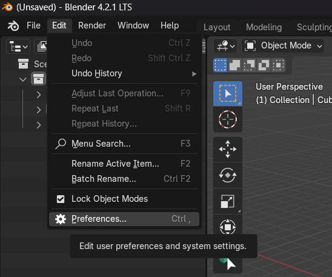
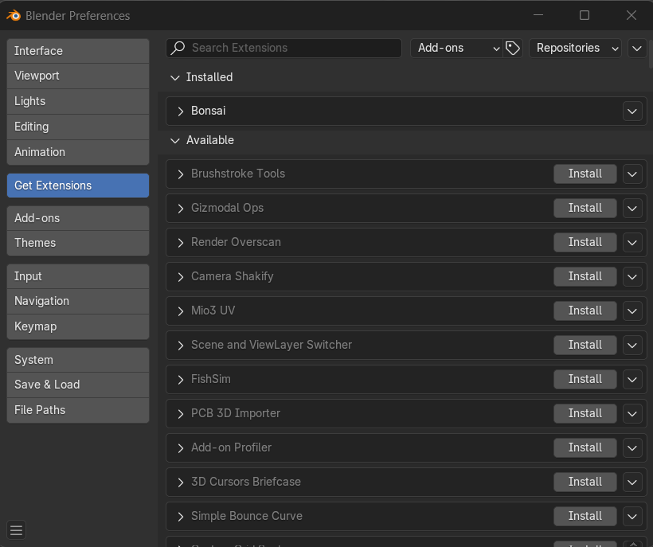

# Introduktion: 
The chosen OpenBIM role is "Analyst Level 3", as a standalone Python programme using IFCOpenshell. The tutorial video explains how to correctly calculate the line load for beams in a building.
The selected OpenBIM role focuses on the automation of beam load calculations, designed to demonstrate how to work with BlenderBIM scripting for structural analysis. This introductory script showcases how to filter specific beams based on naming conventions, retrieve key properties like dimensions and material density, and calculate the self-weight load for each beam. It further groups beams with identical properties, providing a summary for easy comparison.

The purpose of this OpenBIM task is to show how BlenderBIM can be used to fill in missing data or perform custom analyses, making it useful for both newcomers and experienced users. By using scripting, the self-weight of beams is calculated accurately and saved, allowing for detailed documentation or further analysis.

This focus on structural load calculations is relevant for engineers and designers aiming to ensure the safety and efficiency of building structures. Proper load calculations contribute to the structural integrity of a building, ensuring that it can withstand applied forces while remaining energy-efficient. Additionally, accurate load calculations help building owners and stakeholders make informed decisions on materials and design, potentially lowering material costs and enhancing sustainability through optimized structural design.

# Guide:
This is a guide on how to install _**Blender**_ and _**Blender Add-ons**_. Additionally, we'll demonstrate how to use a script on an IFC file in Blender BIM.

1. Download and install Blender:
First you have to download [Blender](https://www.blender.org/download/), which is a free and open-source program for 3D authoring. _**Blender**_ works on Linux, Mac, and Windows. You need to choose your preference. Once you have downloaded _**Blender**_, click on the completed download and open the _**Blender**_ setup. Click "Next". Now you will proceed to the "End-User License Agreement", where you accept the terms. Click "Next". In the new window "Custom Setup", click "Next" again. Now you are ready to instal Blender, so click "Install". Once the installation is complete, click "Finish". Now _**Blender**_ is installed as a program on your computer. Open _**Blender**_, where you will need toperform a quick setup. Click "Next". The program is now ready for use.

2. Download BlenderBIM Add-on:
Now we need to install BlenderBIM Add-on _**Bonsai**_.
_**Bonsai**_ is a native building information model authoring platform using IFC based on the IfcOpenShell library.
After Opening Blender, click on **Edit** > **Prederences**.

Select the **Get Extensions** tab and press **Allow Online Access** on the left. Then search for _**Bonsai**_ in the top left search bar. Now press the **install** bottom to the right. Now _**Bonsai**_ has been installed and you can see it available in your add-ons list. 

4. Import an IFC-file in Blender:
Now you have to import an IFC-file in Blender. In the upper left corner, you'll find the shortcut 'File.' Select 'Open IFC Project' and choose your preferred model.Your building will now appear.

